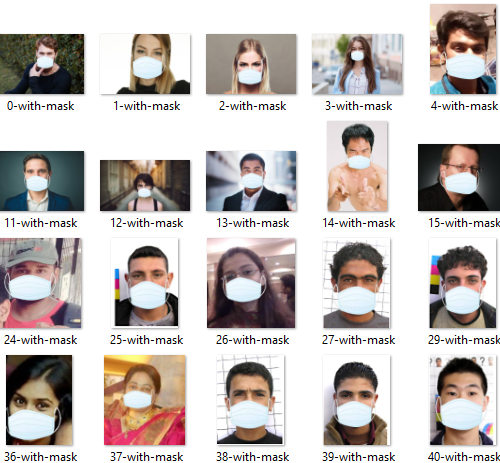
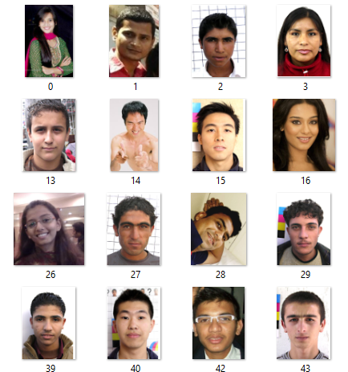

# Detection-of-Face-Mask-with-OpenCV-Keras-and-Deep-Learning
## COVID-19 face mask detector with OpenCV, Keras, and Deep Learning.

In order to train a custom face mask detector, I break this project into two distinct phases, each with its own respective sub-steps:

- <b>Training: </b> Here main focus on loading our face mask detection dataset from disk, training a model (using Keras/TensorFlow) on this dataset, and then serializing the face mask detector to disk
- <b>Deployment: </b> Once the face mask detector is trained, we can then move on to loading the mask detector, performing face detection, and then classifying each face as with_mask or without_mask

## COVID-19 face mask detection dataset

The dataset I’ll be using here was created by <a href="https://www.linkedin.com/feed/update/urn%3Ali%3Aactivity%3A6655711815361761280/" target="_blank">Prajna Bhandary</a>.
