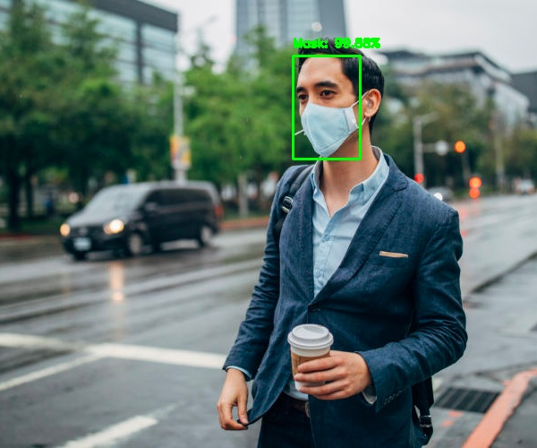
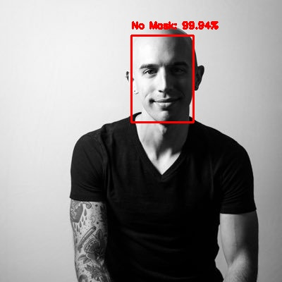
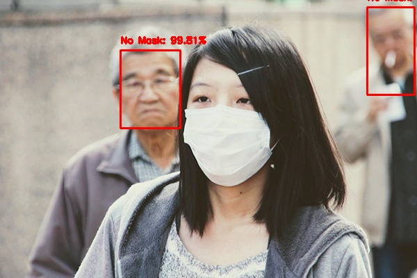
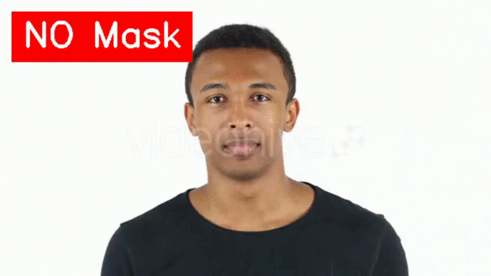

# Detection-of-Face-Mask-with-OpenCV-Keras-and-Deep-Learning
## COVID-19 face mask detector with OpenCV, Keras, and Deep Learning.

In order to train a custom face mask detector, I break this project into two distinct phases, each with its own respective sub-steps:

- <b>Training: </b> Here main focus on loading our face mask detection dataset from disk, training a model (using Keras/TensorFlow) on this dataset, and then serializing the face mask detector to disk
- <b>Deployment: </b> Once the face mask detector is trained, we can then move on to loading the mask detector, performing face detection, and then classifying each face as with_mask or without_mask

## COVID-19 face mask detection dataset

             

The dataset I’ll be using here was created by <a href="https://www.linkedin.com/feed/update/urn%3Ali%3Aactivity%3A6655711815361761280/" target="_blank">Prajna Bhandary</a>.

### This dataset consists of 1,376 images belonging to two classes:

- <b>with_mask:</b> 690 images
- <b>without_mask:</b> 686 images

### We’ll be reviewing four Python scripts in this project:

- <b>train_mask_detector.py:</b> Accepts our input dataset and fine-tunes MobileNetV2 upon it to create our mask_detector.model. A training history plot.png containing accuracy/loss curves is also produced
- <b>image.py:</b> Performs face mask detection in static images
- <b>video.py:</b> Performs face mask detection in static video
- <b>realtime.py:</b> Using your webcam, this script applies face mask detection to every frame in the stream

## Installation:

- `keras`
- `tensorflow`
- `imutils`
- `matplotlib`
- `numpy`
- `sklearn`

## To Run the Code:

- `python image.py`
- `python video.py`
- `python realtime.py`
- `python train_mask_detector.py`

## Screenshots:

As you can see, our face mask detector correctly labeled this image as Mask.

Our face mask detector has correctly predicted No Mask.

What happened here?

Why is it that we were able to detect the faces of the two gentlemen in the background and correctly classify mask/no mask for them, but we could not detect the woman in the foreground?
Keep in mind that in order to classify whether or not a person is wearing in mask, we first need to perform face detection — if a face is not found (which is what happened in this image), then the mask detector cannot be applied!

### The reason we cannot detect the face in the foreground is because:

It’s too obscured by the mask
The dataset used to train the face detector did not contain example images of people wearing face masks
Therefore, if a large portion of the face is occluded, our face detector will likely fail to detect the face.

Just follow☝️ me and Star⭐ my repository

